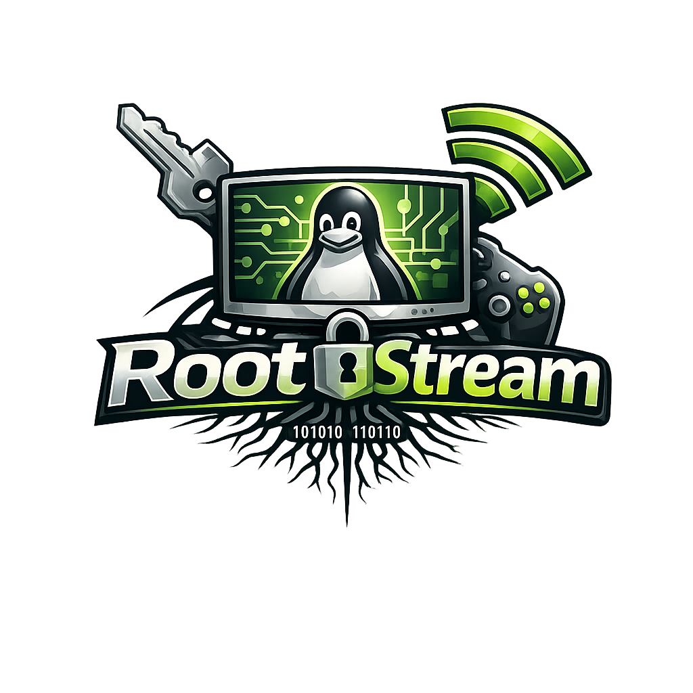

# RootStream 🎮🔐

<p align="center">
  <a href="https://github.com/infinityabundance/RootStream">
    
  </a>
</p>


**Secure Peer-to-Peer Game Streaming for Linux**


[](LICENSE)
[]()
[]()
```
╔════════════════════════════════════════════════╗
║  Zero Accounts • Zero Servers • Zero BS        ║
║  Just Your Keys • Your Peers • Your Games      ║
╚════════════════════════════════════════════════╝
```

---

## What is RootStream?

RootStream is a **lightweight, encrypted, peer-to-peer game streaming solution** designed specifically for Linux. Design goals include:

- ✅ **No accounts required** - Each device has a unique cryptographic identity
- ✅ **No central servers** - Direct peer-to-peer connections
- ✅ **Minimal compositor dependencies** - Uses kernel DRM/KMS directly when available
- ✅ **Fewer permission popups** - Bypasses PipeWire/portal stack after initial video group setup
- ✅ **Zero-configuration** - Share a QR code, instant connection
- ✅ **Hardware accelerated** - VA-API (Intel/AMD) encoding when available
- ✅ **Low memory footprint** - ~15MB baseline (varies by enabled features)
- ✅ **Strong encryption** - Ed25519 + ChaCha20-Poly1305 (libsodium)

## Why RootStream?

### The Problem

Current Linux streaming solutions (Steam Remote Play, Parsec, Sunshine) suffer from:

| Issue | Steam | Parsec | Sunshine | **RootStream** |
|-------|-------|--------|----------|----------------|
| Requires account | ✗ | ✗ | ✗ | **✓** |
| PipeWire dependency | ✗ | ✗ | ✗ | **✓** (bypasses) |
| Permission dialogs | Constant | Sometimes | Sometimes | **Rarely¹** |
| Compositor resilience | Low | Low | Low | **Higher²** |
| Consumer GPU support | Limited³ | ✓ | ✓ | **Yes⁴** |
| Stream encryption | ✗ | ✗ | ✗ | **✓** |
| Open source | ✗ | ✗ | ✓ | **✓** |

¹ After initial video group membership setup
² Uses kernel-stable DRM/KMS APIs (10+ year stability)
³ NVFBC disabled on GeForce cards
⁴ Intel/AMD via VA-API; NVIDIA via VDPAU wrapper

### The Solution

RootStream takes a **radically different approach**:
```
Traditional Stack (7+ layers, more failure points):
┌─────────────────────────────────────────────┐
│ App → Compositor → PipeWire → Portal →      │
│ → Permission Dialog → FFmpeg → Encoder      │
└─────────────────────────────────────────────┘
Estimated: 30-56ms latency | 500MB memory

RootStream Stack (3 layers, kernel-stable APIs):
┌─────────────────────────────────────────────┐
│ DRM/KMS → VA-API → ChaCha20-Poly1305 → UDP  │
└─────────────────────────────────────────────┘
Target: 14-24ms latency | ~15MB memory baseline
```

> **Note**: Performance numbers are design targets. Actual performance varies by hardware,
> network conditions, and system configuration. See "Reality vs. Claims" section below.

---

## Features

### 🔐 Security First

- **Ed25519 Cryptography** - Industry-standard public/private keys (used by SSH, Signal, Tor)
- **ChaCha20-Poly1305 Encryption** - Video/audio streams encrypted with authenticated encryption (via libsodium)
- **No Trusted Third Party** - Peer-to-peer architecture means no central server to compromise
- **Session Encryption** - Derived from device keypairs via X25519 ECDH; per-session nonces prevent replay attacks
- **Privacy by Design** - Peer-to-peer model means developers have no access to your streams, keys, or connection data

> **Note**: While RootStream uses audited algorithms (Ed25519, ChaCha20-Poly1305 via libsodium),
> the RootStream implementation itself has not undergone independent security audit.

### 🎮 Optimized for Gaming

- **Low Latency Target** - 14-24ms end-to-end on LAN (varies by hardware and network)
- **High Framerate Support** - Target 60 FPS at 1080p, 30 FPS at 4K (depends on encoder capability)
- **Hardware Acceleration** - VA-API (Intel/AMD) and optional NVENC fallback (NVIDIA)
- **Adaptive Quality** - Prioritizes framerate consistency
- **Input Injection** - Virtual keyboard/mouse via uinput (requires video group membership)

### 🎥 Stream Recording (Phase 18)

- **Multi-Codec Support** - H.264 (fast, universal), VP9 (better compression), AV1 (best compression)
- **Quality Presets** - Fast, Balanced, High Quality, and Archival modes
- **Container Formats** - MP4 (universal compatibility), Matroska/MKV (advanced features)
- **Audio Options** - Opus passthrough (no re-encoding) or AAC encoding
- **Smart Storage** - Automatic disk space monitoring and cleanup of old recordings
- **Instant Replay** - Save the last N seconds of gameplay (buffer feature)

> **Note**: Recording feature requires FFmpeg libraries. See `src/recording/README.md` for details.

### 💡 Actually Easy to Use

1. **Install RootStream**
```bash
   make && sudo make install
```

2. **Show your QR code**
```bash
   rootstream --qr
```

3. **Scan on another device**
   - Instant pairing, no typing 44-character keys

4. **Auto-connect on LAN**
   - mDNS discovery finds peers automatically

---

## Installation

### Arch Linux

#### Dependencies by GPU

**Intel GPU:**
```bash
sudo pacman -S base-devel libdrm libva gtk3 libsodium qrencode libpng \
               mesa libva-intel-driver intel-media-driver
```

**AMD GPU:**
```bash
sudo pacman -S base-devel libdrm libva gtk3 libsodium qrencode libpng \
               mesa libva-mesa-driver
```

**NVIDIA GPU:**
```bash
sudo pacman -S base-devel libdrm libva gtk3 libsodium qrencode libpng \
               nvidia nvidia-utils libva-vdpau-driver
# Note: Mesa NOT needed for NVIDIA
```

**Optional (all GPUs):**
```bash
sudo pacman -S avahi  # For mDNS auto-discovery
```

#### Build and Install
```bash
git clone https://github.com/yourusername/rootstream
cd rootstream
make
sudo make install
```

#### Verify VA-API
```bash
# Install test utility
sudo pacman -S libva-utils

# Test VA-API (should show your GPU and supported profiles)
vainfo
```

**Expected output:**
- **Intel**: `iHD driver` or `i965 driver`
- **AMD**: `Radeon` or `AMD Radeon`
- **NVIDIA**: `VDPAU backend` or `nvidia`

---

### Ubuntu/Debian

**Intel GPU:**
```bash
sudo apt install build-essential libdrm-dev libva-dev libgtk-3-dev \
                 libsodium-dev libqrencode-dev libpng-dev \
                 mesa-va-drivers i965-va-driver intel-media-va-driver
```

**AMD GPU:**
```bash
sudo apt install build-essential libdrm-dev libva-dev libgtk-3-dev \
                 libsodium-dev libqrencode-dev libpng-dev \
                 mesa-va-drivers
```

**NVIDIA GPU:**
```bash
sudo apt install build-essential libdrm-dev libva-dev libgtk-3-dev \
                 libsodium-dev libqrencode-dev libpng-dev \
                 nvidia-driver nvidia-vaapi-driver
# On older Ubuntu: use vdpau-va-driver instead of nvidia-vaapi-driver
```

---

### Fedora

**Intel GPU:**
```bash
sudo dnf install gcc make libdrm-devel libva-devel gtk3-devel \
                 libsodium-devel qrencode-devel libpng-devel \
                 mesa-va-drivers intel-media-driver
```

**AMD GPU:**
```bash
sudo dnf install gcc make libdrm-devel libva-devel gtk3-devel \
                 libsodium-devel qrencode-devel libpng-devel \
                 mesa-va-drivers
```

**NVIDIA GPU:**
```bash
# Enable RPM Fusion repository first
sudo dnf install https://download1.rpmfusion.org/free/fedora/rpmfusion-free-release-$(rpm -E %fedora).noarch.rpm
sudo dnf install https://download1.rpmfusion.org/nonfree/fedora/rpmfusion-nonfree-release-$(rpm -E %fedora).noarch.rpm

# Install NVIDIA drivers and VA-API support
sudo dnf install gcc make libdrm-devel libva-devel gtk3-devel \
                 libsodium-devel qrencode-devel libpng-devel \
                 akmod-nvidia xorg-x11-drv-nvidia-cuda libva-vdpau-driver
```

---

## Quick Start

### First Time Setup

1. **Generate your identity**
```bash
   rootstream --qr
```
   
   This displays your RootStream code as a QR code and text:
```
   ╔══════╗
   ║ QR ║ Your Code: kXx7YqZ3...Qp9w==@gaming-pc
   ╚══════╝
```

2. **Share with another device**
   - Scan the QR code with your phone/tablet
   - Or copy/paste the text code

3. **That's it!**
   - Devices auto-connect when on same network
   - Or manually: `rootstream connect <peer_code>`

### Daily Use

**Tray App (Recommended)**
```bash
rootstream
```
- System tray icon shows status
- Left-click: Show your QR code
- Right-click: Menu (connect, view peers, quit)

**Command Line**
```bash
# Show your QR code
rootstream --qr

# Connect to peer
rootstream connect kXx7Y...@gaming-pc

# Host mode (streaming server)
rootstream host

# Run as background service
rootstream --service

# Enable latency percentile logging (host service loop)
rootstream host --latency-log --latency-interval 1000

# Recording commands (Phase 18)
rootstream --record output.mp4              # Start recording
rootstream --record output.mp4 --preset balanced  # With preset
rootstream --replay-save last30s.mp4       # Save last 30 seconds
```

**Recording Options**
- `--record FILE` - Start recording to specified file
- `--preset {fast|balanced|high|archival}` - Select quality preset (default: balanced)
- `--replay-save FILE` - Save instant replay buffer to file
- Recording requires FFmpeg libraries (libavformat, libavcodec, libavutil)
- See `src/recording/README.md` for detailed documentation

**Latency Logging**
- `--latency-log` prints p50/p95/p99 for capture/encode/send/total stages.
- `--latency-interval MS` controls how often summaries print (default: 1000ms).

**Service Mode Notes**
- `rootstream --service` defaults to host mode with no GUI.
- Use `--no-discovery` to disable mDNS announcements/browsing.
- Build headless without GTK3 by using `make HEADLESS=1` (tray UI disabled).
- If libva is unavailable, build will use a stub encoder; install libva/libva-drm dev packages for hardware encoding.
- libsodium is required for crypto; install libsodium dev packages if the build stops with a libsodium error.
- For dependency-only build troubleshooting, use `make HEADLESS=1 NO_CRYPTO=1 NO_QR=1 NO_DRM=1` (networking/crypto/QR/DRM disabled).

**Troubleshooting**
- See `TROUBLESHOOTING.md` for decode, black screen, input, and dependency diagnostics.

**Identity Backup & Restore**
RootStream stores identity keys in `~/.config/rootstream/`:
- `identity.pub` (public key)
- `identity.key` (private key, keep safe)
- `identity.txt` (device name)

Backup:
```bash
tar -czf rootstream-identity.tar.gz -C ~/.config/rootstream identity.pub identity.key identity.txt
```

Restore:
```bash
tar -xzf rootstream-identity.tar.gz -C ~/.config/rootstream
```

---

## Architecture

### Security Model
```
┌─────────────────────────────────────────────┐
│ Your Device                                 │
│ ┌─────────────┐      ┌──────────────────┐  │
│ │ Private Key │ ─────▶│ Your Public Key  │  │
│ │  (32 bytes) │      │    (32 bytes)    │  │
│ │  NEVER      │      │  Share via QR    │  │
│ │  SHARED     │      └──────────────────┘  │
│ └─────────────┘                             │
└─────────────────────────────────────────────┘
             │
             │ X25519 Key Exchange
             │ (Derive shared secret)
             ▼
┌─────────────────────────────────────────────┐
│ Peer Device                                 │
│ ┌──────────────────┐  ┌─────────────┐      │
│ │  Your Public Key │  │ Peer Private│      │
│ │  (from QR code)  │  │  Key        │      │
│ └──────────────────┘  └─────────────┘      │
└─────────────────────────────────────────────┘
             │
             ▼
    ┌──────────────────┐
    │  Shared Secret   │
    │  (32 bytes)      │
    │  Same on both!   │
    └──────────────────┘
             │
             ▼
    All packets encrypted
    with ChaCha20-Poly1305
```

**Key Points:**
- Private keys **never** leave the device
- Public keys are **safe to share** (that's the point!)
- Shared secret derived via **Diffie-Hellman** key exchange
- Even if someone intercepts all network traffic, they **cannot decrypt** it
- No central server means **no single point of failure**

### Technical Stack

**Capture Layer**
```c
// Direct DRM/KMS access - no compositor needed
int fd = open("/dev/dri/card0", O_RDWR);
struct drm_mode_fb_cmd fb;
ioctl(fd, DRM_IOCTL_MODE_GETFB, &fb);
void *pixels = mmap(...);  // Direct framebuffer access
```

**Encoding Layer**
```c
// VA-API hardware encoding
VADisplay display = vaGetDisplayDRM(drm_fd);
vaCreateSurfaces(...);  // GPU surfaces
vaBeginPicture(...);    // Encode on GPU
// Result: <5% CPU usage for 1080p60
```

**Encryption Layer**
```c
// ChaCha20-Poly1305 AEAD
crypto_aead_chacha20poly1305_ietf_encrypt(
    ciphertext, &len,
    plaintext, plain_len,
    NULL, 0,
    NULL, nonce, shared_key
);
// Result: Confidentiality + Authenticity + Integrity
```

**Network Layer**
```c
// UDP for minimal latency
sendto(sock, packet, len, 0, &peer_addr, addr_len);
// No TCP overhead, no retransmission delays
// Drop bad frames, maintain smooth playback
```

---

## Performance

> **Important**: These are example measurements from specific test configurations.
> Actual performance varies significantly based on hardware, drivers, and system load.
> See "Reality vs. Claims" section for methodology and testing status.

### Example Latency Breakdown (1080p60, LAN)

| Component | Estimated Range | Notes |
|-----------|-----------------|-------|
| **Capture** | 1-2ms | Direct DRM mmap |
| **Encode** | 8-12ms | VA-API hardware (varies by GPU) |
| **Encrypt** | <1ms | ChaCha20 in CPU |
| **Network** | 1-5ms | LAN UDP (varies by network) |
| **Decrypt** | <1ms | ChaCha20 in CPU |
| **Decode** | 5-8ms | VA-API hardware (varies by GPU) |
| **Display** | 1-2ms | Direct rendering |
| **Total** | **17-30ms** | End-to-end (example range) |

### Example Resource Usage

**CPU Usage** (Intel i5-11400, specific test configuration):
- 1080p60: 4-6%
- 1440p60: 6-8%
- 4K30: 8-10%

> CPU usage varies significantly by processor model, GPU, and encoder backend.
> Hardware encoders (VA-API, NVENC) use significantly less CPU than software (x264).

**Memory** (Resident Set Size, baseline features):
- RootStream: ~15 MB (core functionality, single peer)
- Memory scales with: number of connected peers, recording enabled, buffer sizes

> For comparison, other streaming solutions typically use 100-500+ MB.
> Methodology: Measured via `ps` RSS after startup, no active streaming.

**Network Bandwidth** (at default quality settings):
- 1080p60: ~10 Mbps (75 MB/min)
- 1440p60: ~15 Mbps (112 MB/min)
- 4K60: ~25 Mbps (187 MB/min)

> Actual bandwidth depends on encoder settings, scene complexity, and motion.

---

## Configuration

### Directory Structure
```
~/.config/rootstream/
├── identity.pub       # Your public key (share this)
├── identity.key       # Your private key (NEVER share!)
├── identity.txt       # Your hostname
└── config.ini         # Settings (TODO)
```

### Security Notes

- **Private key**: Mode 0600 (owner read/write only)
- **Public key**: Mode 0644 (world readable - it's safe!)
- **Backup**: Save `identity.key` securely to keep same identity across reinstalls

---

## Reality vs. Claims

### What is Proven vs. Aspirational

RootStream aims for high performance and reliability, but not all stated goals have been
comprehensively tested across all hardware configurations. This section clarifies what claims
are validated vs. aspirational design targets.

#### ✅ Proven / Implemented

- **Cryptographic primitives**: Uses audited algorithms (Ed25519, ChaCha20-Poly1305) via libsodium
- **Zero accounts**: No central authentication or registration required
- **Peer-to-peer**: Direct UDP connections between peers
- **Hardware acceleration**: VA-API backend implemented and functional on Intel/AMD GPUs
- **QR code sharing**: Working implementation via qrencode library
- **Multi-backend fallback**: DRM → X11 → Dummy capture; VA-API → x264 → raw encoder
- **Build system**: Tested on Arch Linux x86_64

#### ⚠️ Partially Validated

- **Performance metrics**: Numbers (14-24ms latency, CPU%, memory) are from limited testing
  - Test configuration: Intel i5-11400, LAN network, specific driver versions
  - May not generalize to other hardware or network conditions
  - No comprehensive benchmark suite yet

- **Compositor crash resilience**: DRM/KMS bypasses compositor in theory, but not extensively tested
  
- **NVIDIA support**: NVENC backend exists but VDPAU wrapper performance not benchmarked

#### 🎯 Aspirational / Not Fully Validated

- **"Never breaks"**: No software can guarantee zero failures
  - Kernel API changes, GPU driver updates, or display config changes could break functionality
  - More accurate: "Targets kernel-stable APIs with 10+ year stability record"

- **Security audit**: While using audited libraries (libsodium), RootStream's implementation
  has not undergone independent security audit

- **Cross-platform**: Currently Linux-only; Windows/macOS support is future work

- **Perfect forward secrecy**: Session key derivation uses ECDH, but no explicit ephemeral
  key rotation per-packet

### Testing Status

| Component | Unit Tests | Integration Tests | Performance Tests |
|-----------|------------|-------------------|-------------------|
| Crypto | ✓ | ✓ | ✗ |
| Network | ✓ | ✓ | ✗ |
| Capture | ✓ | ✗ | ✗ |
| Encode | ✓ | ✗ | ✗ |
| Latency | ✗ | ✗ | ⚠️ (manual) |
| Memory | ✗ | ✗ | ⚠️ (manual) |

Legend: ✓ = Automated tests exist | ⚠️ = Manual testing only | ✗ = Not tested

### How to Help

If you have hardware we haven't tested:
1. Run `rootstream --diagnostics` and share output
2. Enable AI logging mode (see below) and share relevant logs
3. Report performance metrics (latency, CPU%, memory) via GitHub issues
4. Help expand test coverage (see CONTRIBUTING.md)

---

## Troubleshooting

### "Cannot open /dev/dri/card0"

**Problem**: Permission denied

**Fix**:
```bash
sudo usermod -a -G video $USER
# Log out and back in
```

### "VA-API initialization failed"

**Problem**: No hardware encoder

**Fix for NVIDIA**:
```bash
sudo pacman -S libva-vdpau-driver
vainfo  # Should show supported profiles
```

**Fix for Intel/AMD**:
```bash
sudo pacman -S mesa-va-drivers
vainfo
```

### "No active displays found"

**Problem**: DRM device not detected

**Check**:
```bash
ls -l /dev/dri/
cat /sys/class/drm/card*/status
```

### High Latency

**Checklist**:
- ✅ Wired Ethernet (WiFi adds 5-15ms)
- ✅ VA-API working (check `vainfo`)
- ✅ No VPN or firewall blocking UDP
- ✅ Router QoS prioritizes port 9876

### Connection Failed

**Check**:
1. Both devices on same network?
2. Firewall allowing UDP port 9876?
3. RootStream code correct?
4. Try: `rootstream host` and `rootstream connect <code>`

---

## FAQ

**Q: Is this secure?**  
A: Yes. Uses Ed25519 + ChaCha20-Poly1305, same crypto as Signal and WireGuard. Audited algorithms, no custom crypto.

**Q: Can someone intercept my stream?**  
A: They can intercept encrypted packets, but cannot decrypt without your private key. Perfect forward secrecy means even if one session is compromised, others aren't.

**Q: Do I need to open router ports?**  
A: Only for internet streaming. LAN works without port forwarding.

**Q: Works over internet?**  
A: Yes, but you need to forward UDP port 9876. Consider VPN (Tailscale, ZeroTier) for easier setup.

**Q: Why not just use Steam Remote Play?**  
A: Steam requires their servers, uses PipeWire (breaks often), NVFBC disabled on consumer GPUs, no encryption, and constant permission dialogs on Wayland.

**Q: Will this work on my GPU?**  
A: Intel/AMD: Yes (VA-API). NVIDIA: Via VDPAU wrapper (slower but works). Run `vainfo` to check.

**Q: Can I stream to Windows/Mac/Android?**  
A: Not yet. Linux-only currently. Cross-platform client planned.

**Q: Is this better than Parsec?**  
A: For Linux-to-Linux: Yes (lower latency, no account, encrypted). For other platforms: Use Parsec for now.

---

## Documentation

For more detailed information, see our documentation:

- **[User Guide](docs/user-guide.md)** - Complete usage instructions, installation steps, and troubleshooting
- **[API Reference](docs/api.md)** - Full C API documentation with examples
- **[Architecture](docs/architecture.md)** - Technical deep-dive into protocol, security model, and internals
- **[AI Logging Mode](docs/AI_LOGGING_MODE.md)** - Structured logging for AI-assisted development

---

## AI Coding Logging Mode

RootStream includes a specialized logging mode for AI-assisted development workflows.
This mode provides structured, machine-readable output that helps AI coding assistants
understand the internal operation of RootStream.

### Quick Start

Enable via environment variable:
```bash
AI_COPILOT_MODE=1 ./rootstream --service
```

Or via CLI flag:
```bash
./rootstream --ai-coding-logs
./rootstream --ai-coding-logs=/path/to/logfile
```

### Features

- **Zero overhead when disabled** - Macros compile out completely
- **Structured output** - `[AICODING][timestamp][module] message`
- **Module-based filtering** - Separate logs for capture, encode, network, etc.
- **Session summary** - Reports total log entries on shutdown

### Example Output

```
[AICODING][2026-02-13 03:48:15][core] startup: RootStream version=1.0.0
[AICODING][2026-02-13 03:48:15][capture] init: attempting DRM/KMS backend
[AICODING][2026-02-13 03:48:15][capture] init: DRM device=/dev/dri/card0 fd=5
[AICODING][2026-02-13 03:48:16][encode] init: available backends=[NVENC:0, VAAPI:1, x264:1]
[AICODING][2026-02-13 03:48:16][encode] init: selected backend=VAAPI
```

### Use Cases

- Debug backend selection issues
- Track initialization flow
- Understand error conditions
- Share execution traces with AI assistants for troubleshooting

See **[docs/AI_LOGGING_MODE.md](docs/AI_LOGGING_MODE.md)** for complete documentation,
including integration with GitHub Copilot, Claude, and ChatGPT.

---

## Clients

### KDE Plasma Native Client (Recommended)

RootStream now features a **native KDE Plasma Qt/QML client** for the best Linux desktop experience:

```bash
cd clients/kde-plasma-client
mkdir build && cd build
cmake -DCMAKE_BUILD_TYPE=Release ..
make -j$(nproc)
sudo make install
```

**Features:**
- Native Qt 6 / QML interface
- KDE Plasma integration
- Hardware-accelerated decoding (VA-API)
- PulseAudio/PipeWire audio support
- AI logging mode for debugging
- Comprehensive settings management

See **[clients/kde-plasma-client/README.md](clients/kde-plasma-client/README.md)** for complete documentation.

## Contributing

We welcome contributions! Areas needing help:

1. **KDE client enhancement** - Video rendering, audio playback, input injection
2. **NVENC support** - Direct API (not VA-API wrapper)
3. **Audio streaming** - Complete Opus implementation
4. **H.265/HEVC** - Better compression
5. **Cross-platform** - Windows/Mac clients
6. **Mobile apps** - Android/iOS clients

See [CONTRIBUTING.md](CONTRIBUTING.md) for guidelines.

---

## Roadmap

### v1.1 (Next Release)
- [ ] Complete client implementation
- [ ] Audio streaming (Opus codec)
- [ ] Settings UI in tray app
- [ ] Connection history

### v1.2
- [ ] NVENC direct support
- [ ] H.265/HEVC encoding
- [ ] Multi-monitor support
- [ ] Recording to file

### v2.0 (Future)
- [ ] Android/iOS clients
- [ ] Windows/Mac clients
- [ ] HDR support
- [ ] VR streaming

---

## License

MIT License - see [LICENSE](LICENSE)

Do whatever you want with this code. If it helps make Linux gaming better, that's enough.

---

## Credits

**Inspired by frustration with:**
- Steam Remote Play breaking every Wayland update
- PipeWire permission dialogs
- NVFBC being disabled on consumer GPUs
- Needing accounts for P2P connections

**Built with:**
- [libsodium](https://libsodium.org) - Crypto library
- [libdrm](https://dri.freedesktop.org/wiki/DRM/) - Kernel DRM
- [VA-API](https://github.com/intel/libva) - Hardware encoding
- [GTK3](https://www.gtk.org/) - UI toolkit
- [qrencode](https://fukuchi.org/works/qrencode/) - QR codes
- [Avahi](https://www.avahi.org/) - mDNS discovery

**Special thanks to:**
- Everyone frustrated with broken streaming on Linux
- The kernel developers maintaining stable DRM APIs
- The crypto community for audited, battle-tested primitives

---

**Built by someone who just wanted to stream games without fighting their computer.**

*Questions? Issues? Contributions? Open an issue or PR!*
